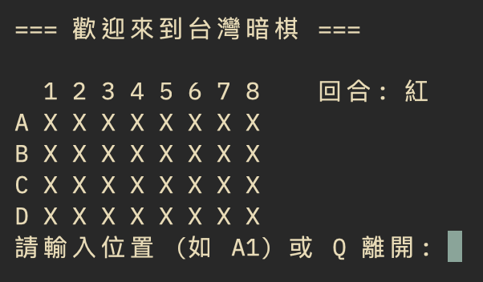
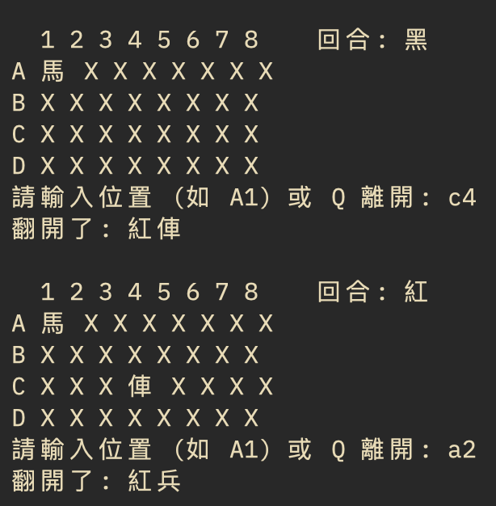
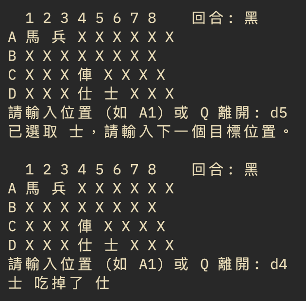
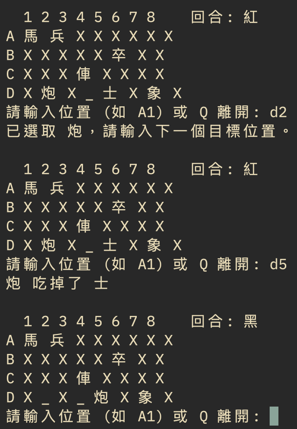

# H1: OOP 作業報告 - 象棋翻棋遊戲

**學號：** D1286314 
**姓名：** 呂偉湘

---

## 🎯 題目說明

### ✍ 練習 2.4.3：象棋翻棋遊戲
* 考慮一個象棋翻棋遊戲，32 個棋子會隨機的落在 4*8的棋盤上。透過 Chess 的建構子產生這些棋子並隨機編排位置，再印出這些棋子的名字、位置
    * `ChessGame`: `void showAllChess()`, `void generateChess()`
    * `Chess`: `Chess(name, weight, side, loc)`, `String toString()`
* `ChessGame` 繼承一個抽象的 `AbstractGame`；`AbstractGame` 宣告若干抽象的方法：
    * `setPlayers(Player, Player)`
    * `boolean gameOver()`
    * `boolean move(int location)`
* 撰寫一個簡單版、非 GUI 介面的 Chess 系統。使用者可以在 console 介面輸入所要選擇的棋子的位置 (例如 A2, B3)，若該位置的棋子未翻開則翻開，若以翻開則系統要求輸入目的的位置進行移動或吃子，如果不成功則系統提示錯誤回到原來狀態。每個動作都會重新顯示棋盤狀態。
* 規則：參考台灣暗棋規則。

---

## 🏗️ 設計方法概述

本專案採用 **物件導向設計 (OOP)** 架構，將遊戲邏輯、實體物件與抽象規範進行分離：

1.  **封裝 (Encapsulation)**：
    *   `Chess` 類別封裝了棋子的屬性（名稱、權重、陣營、位置、是否翻開），並透過 Getter/Setter 提供外部存取。
2.  **抽象化 (Abstraction)**：
    *   `AbstractGame` 定義了遊戲引擎必須具備的藍圖（如 `gameOver`, `move`），確保不同類型的遊戲都能遵循相同的溝通介面。
3.  **繼承 (Inheritance)**：
    *   `ChessGame` 繼承自 `AbstractGame`，實作了具體的台灣暗棋規則，包括洗牌、顯示棋盤與移動邏輯。
4.  **狀態模式 (State Management)**：
    *   在 `ChessGame` 中使用 `selectedRow/Col` 來追蹤玩家的兩次點擊狀態（第一次選棋，第二次移動/吃子），實作非同步的互動邏輯。

---

## 💻 程式碼呈現

### 1. Chess.java (實體類別)
```java
public class Chess {
    private String name;
    private int weight;
    private String side;
    private boolean isFlipped = false;
    // ... 建構子與 Getter/Setter ...
    public void flip() { this.isFlipped = !this.isFlipped; }
}
```

### 2. ChessGame.java (核心邏輯)
```java
public class ChessGame extends AbstractGame {
    private Chess[][] board = new Chess[4][8];
    // 實作翻棋、移動、吃子 (大吃小、炮跳吃)
    public void handleInput(int row, int col) {
        // 狀態判定邏輯...
    }
}
```

---

## 🖼️ 執行畫面及其說明

*(請將執行畫面截圖存放在 `img/` 資料夾中，並確保檔名對應)*

### 1. 遊戲開局

*說明：程式啟動後，隨機產生 32 顆棋子並以 `X` 遮蓋，顯示 A-D 與 1-8 的座標軸。*

### 2. 翻棋動作

*說明：輸入 A1 後，程式將該位置的棋子翻開，並顯示其顏色與名稱。*

### 3. 吃子動作


*說明：選取己方棋子後再次輸入目標座標，若符合「大吃小」或「炮跳吃」規則，則取代目標位置。*

---

## 🤖 AI 使用狀況與心得

### 1. 使用層級
*   **層級 3**：一開始就使用 AI 進行架構設計，並搭配部分自己撰寫與修改。

### 2. 互動次數與內容
*   **互動次數**：約 15-20 次對話。
*   **互動內容**：
    *   **學習**：請 AI 解釋 `Abstract class` 與 `Interface` 的差異。
    *   **架構設計**：請 AI 拆解 Issues，規劃開發步驟。
    *   **除錯**：解決 `ClassNotFoundException` 與 `Git push` 認證問題。
    *   **功能提升**：請 AI 協助實作複雜的「炮」跳吃演算法及「兩次點擊」的狀態切換。

### 3. 手動撰寫部分
*   基本的 `Chess` 屬性宣告、`toString` 覆寫。
*   座標轉換邏輯（將 A1 轉為 0, 0）。
*   `showAllChess` 的棋盤格式美化與座標軸印製。

### 4. 心得與反思
*   **實用性**：AI 在處理重複性高的程式碼（如產生 32 顆棋子的清單）以及複雜的邊界判定（如 `countPiecesBetween`）時非常高效。
*   **觀念澄清**：AI 幫我釐清了「封裝」的重要性，例如解釋為何不應該讓 `Main` 直接讀取 `board` 陣列，而是要透過 `getChess` 方法。
*   **查證與限制**：在開發過程中，AI 曾提供 `./mvnw` 的執行指令，但我的環境並未安裝 Maven Wrapper，這讓我意識到 AI 有時會假設環境已配置完成，仍需手動檢查環境變數。
*   **對學習的影響**：使用 AI 並沒有阻礙我對 OOP 的理解，反而因為它能即時回答我對「繼承」與「多型」的疑惑，讓我能更快地將理論應用到實務專案中。
